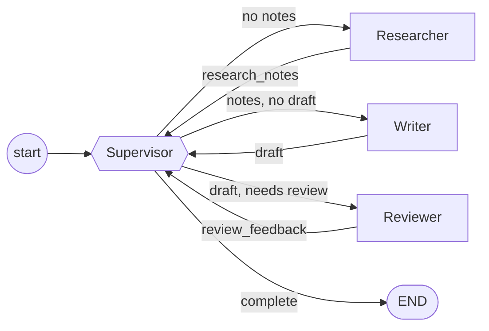

# 🧠 Multi-Agent Research Assistant

A multi-agent AI system built with **[LangGraph](https://github.com/langchain-ai/langgraph)** that turns a single question into a polished, well-researched report. A team of specialized agents — a **Researcher**, a **Writer**, and a **Reviewer** — collaborate under a central **Supervisor** that orchestrates the workflow as a stateful graph.

It demonstrates the **supervisor / orchestrator-worker pattern** for agentic systems, dynamic LLM-based routing via conditional edges, an iterative writer↔reviewer refinement loop, tool use for live web search, and a fully **provider-agnostic** LLM layer (Groq, Gemini, OpenAI, or Anthropic — switchable with one environment variable).

---

## ✨ Features

- **Multi-agent orchestration** — four cooperating agents modeled as nodes in a LangGraph `StateGraph`.
- **Dynamic supervisor routing** — a coordinator node decides which agent runs next based on shared state, instead of a brittle hard-coded pipeline.
- **Iterative refinement** — the Writer and Reviewer loop until the draft is accepted or a maximum revision count is reached, preventing runaway loops.
- **Live web research** — the Researcher gathers up-to-date information using a keyless **DuckDuckGo** search tool, then condenses it.
- **Provider-agnostic LLM layer** — run on **Groq** (free, default), **Gemini**, **OpenAI**, or **Anthropic** by changing `LLM_PROVIDER`.
- **Streaming output** — node-by-node progress is streamed to the terminal as the graph executes.
- **Zero-cost by default** — Groq's free tier + keyless search means it runs without any paid API or credit card.

---

## 🏗️ Architecture



The **Supervisor is a hub**: every worker reports back to it, and it re-decides the next step each time. The Writer↔Reviewer cycle (Writer → Supervisor → Reviewer → Supervisor → Writer …) is what enables iterative refinement, and LangGraph's support for **cycles** is what makes this possible (unlike a plain DAG pipeline).

### Agent roles

| Agent | Responsibility | Tools |
|---|---|---|
| **Supervisor** | Inspects shared state and routes work to the right specialist. Decides when the task is complete. | LLM-based routing |
| **Researcher** | Searches the web for information relevant to the query and distils it into structured notes. | `web_search` (DuckDuckGo), `summarize` |
| **Writer** | Transforms research notes into a clear, well-structured markdown report; incorporates reviewer feedback on revisions. | LLM generation |
| **Reviewer** | Critiques the draft for accuracy, clarity, and completeness; issues an **ACCEPT** or **REVISE** verdict. | LLM evaluation |

---

## ⚙️ How it works

The system is a **state machine**. A single typed `AgentState` object flows through the graph, and each node returns a partial update that LangGraph merges into it.

**Shared state (`AgentState`):**

| Field | Purpose |
|---|---|
| `messages` | Running conversation log (uses the `add_messages` reducer to append). |
| `research_notes` | Findings produced by the Researcher. |
| `draft` | Current report produced by the Writer. |
| `review_feedback` | Reviewer's critique; consumed and cleared by the Writer on each revision. |
| `next_agent` | The Supervisor's routing decision. |
| `revision_count` | Counts revision cycles; caps the loop at `MAX_REVISIONS` (3). |

**Execution flow for one query:**

1. **Supervisor** sees no notes → routes to **Researcher**.
2. **Researcher** runs web search + summarize → writes `research_notes`.
3. **Supervisor** sees notes but no draft → routes to **Writer**.
4. **Writer** drafts a report → writes `draft`.
5. **Supervisor** sees a draft → routes to **Reviewer**.
6. **Reviewer** critiques → `ACCEPT` or `REVISE`.
7. `REVISE` → back to **Writer** (loop); `ACCEPT` or max revisions reached → **END**.

---

## 🧩 Tech stack

| Component | Technology |
|---|---|
| Orchestration | [LangGraph](https://github.com/langchain-ai/langgraph) (`StateGraph`, conditional edges) |
| LLM abstraction | [LangChain](https://github.com/langchain-ai/langchain) (`langchain-core`) |
| LLM — Groq (default) | Llama 3.3 70B via `langchain-groq` |
| LLM — Gemini | `gemini-2.5-flash-lite` via `langchain-google-genai` |
| LLM — OpenAI | GPT-4o via `langchain-openai` |
| LLM — Anthropic | Claude Sonnet 4.5 via `langchain-anthropic` |
| Web search | [DuckDuckGo](https://duckduckgo.com/) (`ddgs`) via `langchain-community` — no API key |
| State & validation | [Pydantic v2](https://docs.pydantic.dev/) |
| Configuration | `python-dotenv` |
| Build backend | [Hatchling](https://hatch.pypa.io/) |
| Package manager | [uv](https://github.com/astral-sh/uv) |
| Linting | [Ruff](https://github.com/astral-sh/ruff) |
| Containerization | Docker (Python 3.12 slim) |

---

## 🚀 Getting started

### Prerequisites
- Python **3.12+**
- [uv](https://github.com/astral-sh/uv) (`curl -LsSf https://astral.sh/uv/install.sh | sh`)
- A free LLM API key (Groq recommended — no credit card)

### Install & run

```bash
# 1. Clone
git clone https://github.com/<your-username>/langgraph-multi-agent.git
cd langgraph-multi-agent

# 2. Configure environment
cp .env-template .env
# Edit .env and add your GROQ_API_KEY (free at https://console.groq.com/keys)

# 3. Install dependencies (creates .venv)
uv sync

# 4. Run a research query
uv run python main.py "What are the latest breakthroughs in quantum computing?"

# Verbose mode prints the full output of every agent
uv run python main.py --verbose "Explain the current state of nuclear fusion energy"
```

---

## 🔧 Configuration

Set the provider with `LLM_PROVIDER` in `.env` and supply the matching key:

| Variable | Required | Description |
|---|---|---|
| `LLM_PROVIDER` | No | `groq` (default), `gemini`, `openai`, or `anthropic` |
| `GROQ_API_KEY` | If `groq` | [Groq](https://console.groq.com/keys) — free tier, no credit card |
| `GOOGLE_API_KEY` | If `gemini` | [Google AI Studio](https://aistudio.google.com) |
| `OPENAI_API_KEY` | If `openai` | OpenAI |
| `ANTHROPIC_API_KEY` | If `anthropic` | Anthropic |

> Web search uses **DuckDuckGo** and requires **no API key**.

---

## 📤 Example output

```text
$ uv run python main.py "Compare React and Svelte for building modern web apps"

============================================================
  Research query: Compare React and Svelte for building modern web apps
============================================================

--- [SUPERVISOR] ---  [Supervisor] Routing to: researcher
--- [RESEARCHER] ---  [Researcher] Gathered notes: ...
--- [SUPERVISOR] ---  [Supervisor] Routing to: writer
--- [WRITER] ---      [Writer] Draft produced (2847 chars)
--- [SUPERVISOR] ---  [Supervisor] Routing to: reviewer
--- [REVIEWER] ---    [Reviewer] Verdict: ACCEPT
--- [SUPERVISOR] ---  [Supervisor] Routing to: FINISH

============================================================
  FINAL REPORT
============================================================

## React vs. Svelte: A Comparative Analysis
...
```

---

## 🐳 Docker

```bash
docker build -t research-assistant .
docker run --env-file .env research-assistant "Your research query here"
```

The image uses a multi-stage build with `uv` for fast, reproducible dependency installation on a `python:3.12-slim` base.

---

## 📁 Project structure

```
langgraph-multi-agent/
├── agents/
│   ├── __init__.py
│   ├── config.py      # Provider-agnostic LLM factory (Groq/Gemini/OpenAI/Anthropic)
│   ├── graph.py       # AgentState, agent nodes, routing, and StateGraph assembly
│   └── tools.py       # Custom tools: web_search (DuckDuckGo) + summarize
├── main.py            # CLI entry point — builds and streams the graph
├── pyproject.toml     # Project metadata, dependencies, tooling config
├── Dockerfile         # Multi-stage container build
├── .env-template      # Environment variable template
└── README.md
```

---

## 🧠 Design notes

- **Supervisor / orchestrator-worker pattern** — a central node routes to specialist workers, keeping the workflow flexible and extensible (adding an agent = add a node + a routing branch).
- **Conditional edges** — the Supervisor uses `add_conditional_edges` so the next step is decided at runtime from state, rather than fixed at graph-build time.
- **Reducers** — `messages` uses LangGraph's `add_messages` reducer to append history; other fields overwrite by default.
- **Loop safety** — `revision_count` + `MAX_REVISIONS` guarantees termination of the writer↔reviewer loop.
- **Factory + Strategy** — `get_llm()` constructs the configured provider behind a single interface, with lazy imports so only the chosen SDK is required.

## 🗺️ Possible extensions

- **Human-in-the-loop** — pause before the Reviewer using LangGraph's `interrupt_before` + a checkpointer to let a human inject feedback.
- **Persistence** — add a checkpointer (e.g. `MemorySaver` or a database) to pause/resume runs and support multi-turn sessions.
- **Structured routing** — replace prose-based verdict parsing with structured output (function calling / Pydantic schemas) for more reliable control flow.
- **Parallel research** — fan out multiple search queries concurrently and merge results.
- **Test suite** — unit tests for nodes/routing and an integration test for the full graph.

---

## 📄 License

MIT
